# 安卓上位机与嵌入式下位机控制方案设计书

本方案基于当前“打锅机项目”的业务需求，将底层的 PLC 执行器替换为基于 **ARM Cortex-M 架构微控制器（MCU）**的嵌入式下位机控制板。该方案保持现有的**多宫格出水模式**、**左上角工位辅料约束**、**人工/自动转锅相位控制**等核心逻辑不变，重新设计了软硬件架构、物理接口、通信协议与双机握手机制。

---

## 1. 系统架构概述

系统分为两层：
1. **上位机（Android 控制台）**：采用工业级瑞芯微（Rockchip）RK3568/RK3288 主板，运行 Android OS。负责网络接单、UI 显示、配方解析、工艺相位编排、指令下发及状态上报。
2. **下位机（嵌入式控制板）**：采用以 STM32F4/GD32F3 系列为核心的 MCU 控制板，运行实时操作系统（RTOS）。负责传感器采集、转锅驱动、阀泵控制及物理联锁安全保护。

### 1.1 系统拓扑结构图

```mermaid
graph TD
    %% 外部网络与云端
    Cloud[云端订单/配方后台] <-->|HTTP / HTTPS| Android[安卓上位机 RK3568]
    
    %% 安卓上位机内部与接口
    subgraph 安卓上位机 (HMI 控制台)
        AndroidUI[Jetpack Compose UI] <--> AndroidCore[MachineCoordinator 核心调度]
        AndroidCore <--> AndroidSerial[Serial Port Driver /dev/ttyS*]
    end

    %% 通信总线
    AndroidSerial <-->|RS485 总线 / 115200 8N1| MCU_Serial[RS485 接口芯片 SP3485]

    %% 下位机内部与接口
    subgraph 嵌入式下位机 (MCU 控制板)
        MCU_Serial <--> MCU[微控制器 MCU STM32/GD32]
        
        %% 输入信号
        Sensors[传感器组: 水位/温度/光电限位/按键] -->|光耦隔离输入 GPIO/ADC| MCU
        
        %% 输出控制
        MCU -->|GPIO 控制信号| Drivers[驱动电路: 继电器/MOS管]
    end

    %% 物理执行机构
    Drivers -->|电气驱动| Motors[转锅机构]
    Drivers -->|强电驱动| Valves[水/鸡油/骨膏电磁阀 & 泵]
    Drivers -->|强电驱动| Heaters[加热管 (SSR 固态继电器控制)]
```

---

## 2. 硬件接口设计

为了保证下位机在恶劣的厨房环境（高温、潮湿、油污、电磁干扰）中稳定运行，控制板必须进行物理隔离和滤波设计。

### 2.1 下位机 MCU 主控板接口规格

| 接口分类 | 信号名称 | 硬件引脚/模块 | 电气规范 | 物理用途说明 |
| :--- | :--- | :--- | :--- | :--- |
| **通信接口** | RS485 | USART1 + SP3485 | 3.3V TTL 转 A/B 差分信号 | 与安卓上位机通信，支持抗雷击、防静电保护 |
| **通信接口** | CAN Bus | CAN1 + TJA1050 | CAN_H / CAN_L 差分 | 备用通信总线，用于高可靠性环境扩展 |
| **转锅控制** | Motor_Control | GPIO (DO) | 继电器/MOS管控制 | 转锅启动/停止与方向电气控制 |
| **数字输入 (DI)** | Limit_SW_1 | GPIO | 24V NPN 光耦隔离输入 | 1号物理工位（左上）就位接近开关/光电开关 |
| **数字输入 (DI)** | Limit_SW_Home| GPIO | 24V NPN 光耦隔离输入 | 物理零位（Home）传感器，用于开机寻零复位 |
| **数字输入 (DI)** | Water_Level_0| GPIO | 24V NPN 光耦隔离输入 | 储水箱/料箱低水位传感器 |
| **数字输入 (DI)** | Water_Level_1| GPIO | 24V NPN 光耦隔离输入 | 储水箱/料箱高水位传感器 |
| **数字输入 (DI)** | Emergency_Key| GPIO | 24V NPN 光耦隔离输入 | 物理急停按钮状态输入 |
| **数字输出 (DO)** | Valve_Water_1~4| GPIO | 24V NPN 漏极输出 (MOS管) | 控制 1~4 号通道的普通加水电磁阀 |
| **数字输出 (DO)** | Pump_Oil | GPIO | 继电器/MOS管控制 | 鸡油泵启动控制 |
| **数字输出 (DO)** | Pump_Paste | GPIO | 继电器/MOS管控制 | 骨膏泵启动控制 |
| **模拟输入 (AI)** | Temp_PT100 | ADC / MAX31865 | SPI / 模拟差分 | 监测锅底/加热器实时温度 |

---

## 3. 自定义双机通信协议

虽然可以继续使用 Modbus RTU，但在嵌入式定制方案中，采用**自定义包头尾及长度校验的帧协议**具有更高的实时性、更好的纠错重发机制以及更低的数据解析开销。

### 3.1 帧格式定义 (Frame Format)

数据帧采用固定包头包尾，中间携带变长载荷，并通过 CRC16 确保数据传输的完整性。

| 字节偏移 | 字段名 | 长度 (Bytes) | 默认值/范围 | 说明 |
| :--- | :--- | :--- | :--- | :--- |
| 0 ~ 1 | **Frame Header** | 2 | `0x5A 0xA5` | 固定帧头，标示数据帧起始 |
| 2 | **Device ID** | 1 | `0x01` | 设备地址（通常下位机为 0x01） |
| 3 | **Msg Type** | 1 | 参见下方类型 | `0x10`: 下发命令, `0x20`: 响应, `0x30`: 状态主动上报 |
| 4 | **Command ID**| 1 | 参见命令表 | 具体业务指令码 |
| 5 | **Length (N)** | 1 | `0 ~ 64` | 仅指 **Payload** 字段的字节长度 |
| 6 ~ (5+N) | **Payload** | N | 变长数据 | 根据 Command ID 定义的载荷数据 |
| (6+N) ~ (7+N)| **CRC16** | 2 | 变长 | 校验从字节2到(5+N)的所有数据 (Modbus CRC16算法) |
| (8+N) | **Frame Tail** | 1 | `0x0D` | 固定帧尾（回车符 `\r`） |

### 3.2 核心命令集设计

#### A. 下发工艺相位指令 (Command ID: `0x11`)
上位机在每个工艺步骤（如第一步常规加水、第二步转锅后左上角加辅料）下发具体的运行参数。
* **Payload 格式** (11 字节)：
  * `Byte 0`: 相位数 (e.g. `0x01` 代表第一相位, `0x02` 代表第二相位)
  * `Byte 1`: 目标物理就位工位号 (`1 ~ 4`)，指明本相位需要哪个锅位转到左上角。如果不涉及转锅（只是普通并行加水），该字节填当前工位。
  * `Byte 2 ~ 3`: 1号位加水时长 (单位: 100ms)
  * `Byte 4 ~ 5`: 2号位加水时长 (单位: 100ms)
  * `Byte 6 ~ 7`: 3号位加水时长 (单位: 100ms)
  * `Byte 8 ~ 9`: 4号位加水时长 (单位: 100ms)
  * `Byte 10`: 鸡油加料时长 (单位: 100ms，仅当目标工位对齐左上角时有效)
  * `Byte 11`: 骨膏加料时长 (单位: 100ms，仅当目标工位对齐左上角时有效)

#### B. 查询/上报设备状态 (Command ID: `0x12`)
上位机轮询或者下位机主动上传（50ms~100ms 周期）当前的运行状态。
* **Payload 格式** (16 字节)：
  * `Byte 0`: 下位机当前状态机主状态 (`0x00`:空闲, `0x01`:回零中, `0x02`:转锅旋转中, `0x03`:执行相位中, `0x04`:暂停中, `0x90`:急停报警, `0x91`:故障卡死)
  * `Byte 1`: 当前处于左上角工位的物理锅位号 (`1 ~ 4`)
  * `Byte 2`: 物理行程/光电开关状态字 (按位：Bit0=Home位，Bit1=1号位就位，Bit2=限位开关)
  * `Byte 3`: 阀与泵的输出状态字 (按位：Bit0~3对应水阀1~4，Bit4=鸡油泵，Bit5=骨膏泵)
  * `Byte 4 ~ 7`: 当前相位的剩余加水时间（4路，各1字节，单位: 秒）
  * `Byte 8 ~ 9`: 剩余辅料添加时间（鸡油、骨膏各1字节，单位: 秒）
  * `Byte 10 ~ 11`: 当前系统温度 (单位: 0.1 ℃)
  * `Byte 12`: 水位状态 (`0x00`: 正常, `0x01`: 缺水报警)
  * `Byte 13`: 错误码 (`0x00`: 无错误, `0x01`: 转锅过载/堵转, `0x02`: 通信超时, `0x03`: 超温)
  * `Byte 14 ~ 15`: 心跳计数器（每发送一次累加 1）

---

## 4. 控制逻辑与双机安全握手状态机

由于嵌入式硬件具有更强的实时中断能力，我们可以设计出比 PLC 通信更加严密、安全的**双机握手状态机**。这能防止因为串口断开、死机导致的“电磁阀无限放水”或“转锅失控旋转”等厨房灾难性故障。

### 4.1 双机心跳握手机制 (Heartbeat)
* **下位机安全监视器（Watchdog Timer）**：
  * 下位机内部启动一个 500ms 的软件看门狗定时器。
  * 上位机必须在每 300ms 内向下位机发送一次心跳包（或者通过轮询命令）。
  * 一旦下位机超过 1000ms 没有收到上位机数据包，判定为**上位机卡死或串口断开**。
  * **下位机将立即强行关闭所有水阀、强行关闭所有加料泵、停止转锅旋转，进入安全保护状态，直至心跳恢复。**

### 4.2 相位执行与转锅逻辑控制时序

```mermaid
sequenceDiagram
    participant App as 安卓上位机 (HMI)
    participant MCU as 嵌入式下位机 (MCU)
    participant Hardware as 强电执行机构 (阀/泵/转锅机构)

    rect rgb(25, 35, 50)
        Note over App, MCU: 准备阶段
        App->>MCU: 发送指令 0x11 (相位 1：普通加水)
        MCU->>App: 响应 0x11 接收成功 (Ack)
        MCU->>MCU: 校验数据有效性，进入执行状态
    end

    rect rgb(30, 45, 60)
        Note over MCU, Hardware: 相位 1 物理执行
        MCU->>Hardware: 打开对应出水通道电磁阀
        loop 倒计时中 (100ms 周期)
            MCU->>Hardware: 监测水位与就位状态
            MCU->>App: 主动上报实时状态 (0x12 状态字与倒计时)
        end
        MCU->>Hardware: 关闭所有水阀
        MCU->>App: 上报相位 1 执行完毕 (State = Idle)
    end

    rect rgb(45, 30, 30)
        Note over App, MCU: 转锅控制 (Phase Rotation)
        App->>UI: 触发“请确认转锅”弹窗 / 提示旋转
        App->>MCU: 发送指令 0x11 (相位 2: 目标位置=2号工位, 鸡油=3s, 骨膏=2s)
        MCU->>Hardware: 启动转锅机构旋转
        MCU->>App: 状态上报 (State = 转锅旋转中)
        Hardware->>MCU: 2号工位就位光电开关触发 (GPIO 中断)
        MCU->>Hardware: 锁定就位工位
        MCU->>App: 状态上报 (State = 执行相位中，当前工位=2号位)
    end

    rect rgb(30, 45, 60)
        Note over MCU, Hardware: 相位 2 辅料加料
        MCU->>Hardware: 启动鸡油泵、骨膏泵及加水阀
        loop 辅料添加倒计时
            MCU->>App: 主动上报剩余秒数
        end
        MCU->>Hardware: 关闭泵与阀门
        MCU->>App: 上报相位 2 执行完毕 (State = Idle)
    end
```



---

## 5. 下位机固件软件架构 (RTOS 任务划分)

下位机建议使用轻量级实时操作系统（如 **FreeRTOS** 或 **RT-Thread Nano**），以任务（Thread/Task）为单位进行功能隔离，确保核心控制任务不受低优先级任务（如温度测量、串口通信）的阻塞影响。

### 5.1 固件任务（线程）优先级设计

| 任务名称 | 优先级 (1~10) | 执行周期 (ms) | 职责描述 |
| :--- | :--- | :--- | :--- |
| **Emergency_Task**| 10 (最高) | 中断触发 / 5 | 监听急停按钮、安全光幕。一旦触发，通过硬件 GPIO 瞬间关闭所有输出继电器 |
| **Comm_Task** | 9 | 收到数据即时 / 10 | 串口接收中断处理，进行协议帧的校验、解包，并分发命令到业务队列 |
| **Process_Task** | 8 | 20 | 负责转锅、加水阀和辅料泵的时间与就位逻辑控制 |
| **Sensor_Task** | 5 | 100 | 读取水位传感器、温度传感器（ADC/SPI 转换与软件均值滤波） |
| **WDT_Heartbeat** | 6 | 200 | 看门狗看护，检测与上位机的心跳连接是否超时 |

---

## 6. 安卓上位机适配层设计 (Android Upper Host)

在上位机安卓代码库中，我们需要把原本的 [PlcPollingService.kt](file:///D:/Users/achillesniu/Documents/pot_machine_project/app/src/main/java/com/example/plccontroller/runtime/PlcPollingService.kt) 以及 [ModbusRtu.kt](file:///D:/Users/achillesniu/Documents/pot_machine_project/data/plc/ModbusRtu.kt) 替换为自定义的串口解析驱动。

### 6.1 安卓端适配核心代码结构设计

由于 Kotlin 的协程及流（Flow）非常适合处理异步数据，我们可以在上位机适配层设计 `EmbeddedControlClient`：

```kotlin
// 1. 定义通信数据帧
data class EmbeddedFrame(
    val msgType: Byte,
    val commandId: Byte,
    val payload: ByteArray
)

// 2. 串口监听与解析器 (利用协程 Flow 连续读取并解析)
class EmbeddedFrameParser(private val inputStream: InputStream) {
    fun startParsing(): Flow<EmbeddedFrame> = flow {
        val buffer = ByteArray(1024)
        var bytesRead = 0
        while (coroutineContext.isActive) {
            // 串口数据粘包/半包解析算法
            val read = inputStream.read(buffer, bytesRead, buffer.size - bytesRead)
            if (read > 0) {
                bytesRead += read
                var index = 0
                while (index < bytesRead - 1) {
                    // 寻找固定帧头 0x5A 0xA5
                    if (buffer[index] == 0x5A.toByte() && buffer[index + 1] == 0xA5.toByte()) {
                        if (index + 6 <= bytesRead) {
                            val payloadLen = buffer[index + 5].toInt() and 0xFF
                            val totalFrameLen = 6 + payloadLen + 2 + 1 // 头+设备ID+MsgType+Cmd+Len + Payload + CRC + 尾
                            if (index + totalFrameLen <= bytesRead) {
                                val frameData = buffer.copyOfRange(index, index + totalFrameLen)
                                if (validateCrcAndTail(frameData)) {
                                    emit(parseFrame(frameData))
                                }
                                index += totalFrameLen
                                continue
                            }
                        }
                    }
                    index++
                }
                // 整理剩余数据
                if (index > 0) {
                    System.arraycopy(buffer, index, buffer, 0, bytesRead - index)
                    bytesRead -= index
                }
            }
            delay(10) // 避免空转
        }
    }
}
```

### 6.2 错误恢复与容错设计
1. **重试机制**：上位机下发工艺相位指令 `0x11` 后，若下位机在 150ms 内未返回接收响应（Ack），上位机将自动重发数据，最多重发 3 次。3 次均失败则判定为串口线路故障，UI 弹出“下位机通信丢失”警告。
2. **断线重连**：当串口物理链路意外断开，Android 适配层自动执行 `close()` 并启动每隔 1.5 秒的重连（Re-open）轮询机制，直至成功重新握手。

---

## 7. 方案优势总结

1. **显著降本**：原方案采用商业 PLC，加上 IO 模块和 Modbus 扩展卡，硬件成本通常在数百元人民币；采用定制嵌入式 MCU 控制板，量产成本可以控制在百元以内。
2. **高频就位控制**：MCU 直接进行就位信号中断响应，相比于上位机通过 Modbus 轮询产生的网络延迟，转锅的旋转就位精度更高、物理响应更及时。
3. **更强的系统安全性**：在自定义协议中融入了硬软件看门狗及快速熔断机制，一旦上位机死机或物理线路受损，下位机能在一秒内自锁关闭阀门，避免喷水漫水事故。
4. **易于扩展物联网 (IoT)**：可在嵌入式控制板上预留 Wi-Fi/蓝牙（如 ESP32）或 4G 模组插槽，为设备后期升级脱网独立运行提供平滑过渡支持。
