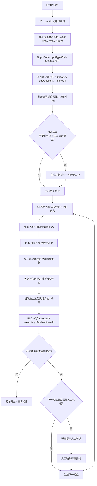
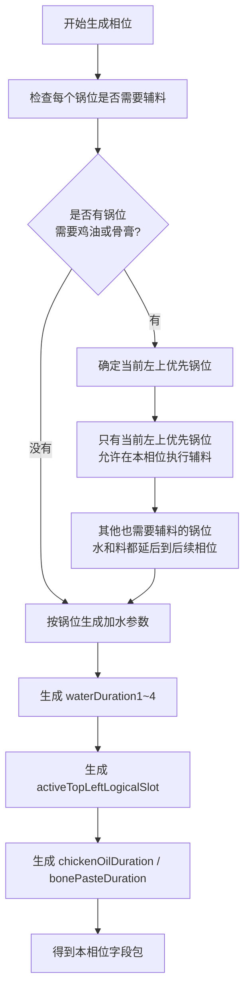
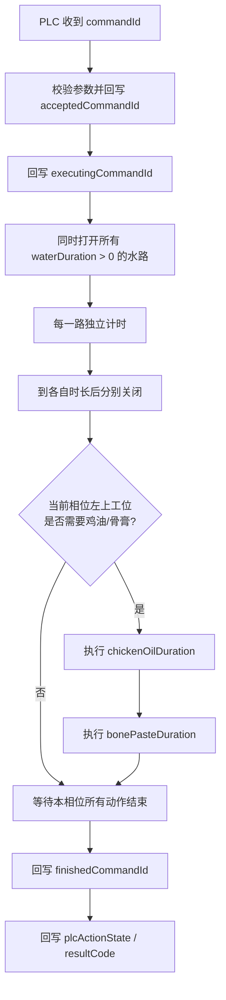

# 接单到 PLC 执行流程图

关联文档：
[architecture.md](/D:/Users/achillesniu/Documents/自研打锅机项目/docs/architecture.md)
[control-routing.md](/D:/Users/achillesniu/Documents/自研打锅机项目/docs/control-routing.md)
[plc-command-handshake-draft.md](/D:/Users/achillesniu/Documents/自研打锅机项目/docs/plc-command-handshake-draft.md)
[plc-phase-field-draft.md](/D:/Users/achillesniu/Documents/自研打锅机项目/docs/plc-phase-field-draft.md)

## 1. 主流程

## 2. 相位生成规则

## 3. PLC 执行规则

## 4. 当前最关键的现场规则

1. 加水是统一启动，不是统一停止。
2. 每个锅位的加水停止时间必须按自己的锅底配方独立控制。
3. 只要存在需要辅料但当前不在左上的锅位，就应优先先把其中一个转到左上。
4. 非左上且也需要辅料的锅位，水和料都应延后到后续相位。
5. 鸡油和骨膏只属于当前左上工位对应的那个逻辑锅位。
6. 人工转锅是安卓流程控制步骤，不是 PLC 自动旋转动作。
