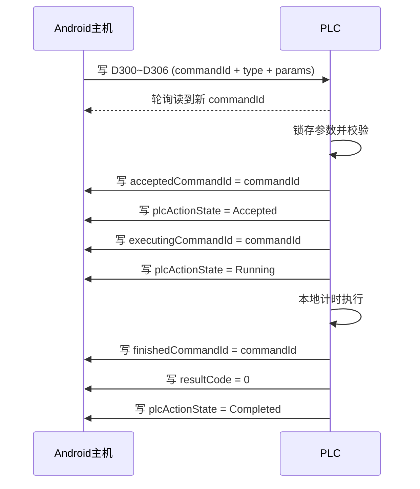

# 上下位机握手协议草案

关联文档：
[plc-register-map-baseline.md](/D:/Users/achillesniu/Documents/自研打锅机项目/docs/plc-register-map-baseline.md)
[plc-action-execution-baseline.md](/D:/Users/achillesniu/Documents/自研打锅机项目/docs/plc-action-execution-baseline.md)
[architecture.md](/D:/Users/achillesniu/Documents/自研打锅机项目/docs/architecture.md)

这份草案专门解决一个问题：

`安卓主机下发参数和启动动作时，怎样避免 start/done 标志位互相清除、互相抢状态`

## 1. 核心原则

这套协议建议牢牢守住下面 5 条：

1. 谁写，谁清。
2. 安卓只写命令区，不清 PLC 状态区。
3. PLC 只写状态区，不清安卓命令区。
4. 少依赖单个布尔位，多依赖 `commandId + 状态码`。
5. 一次动作的执行时序由 PLC 本地计时完成，安卓不负责“到点再发停止”。

## 2. 为什么不建议只用 `start/done`

如果协议只靠下面这组位：

1. 安卓写 `start`
2. PLC 写 `done`
3. 双方再讨论谁去清

很容易出现这些问题：

1. 到底谁清 `start`
2. 到底谁清 `done`
3. 串口超时后安卓不知道 PLC 有没有真的收到
4. 安卓重发时容易导致 PLC 重复执行
5. PLC 扫描周期和安卓轮询周期不同，边沿容易漏读

所以更稳的方式是：

`命令号驱动 + 状态寄存器驱动`

## 3. 建议的总体结构

建议新开一块独立协议区，不和当前 `M100 ~ M110`、`D200 ~ D214` 混用。

当前建议：

1. 命令区：安卓写
2. 状态区：PLC 写
3. 参数区：安卓写
4. 结果区：PLC 写

为了减少“谁清谁”的争议，建议协议主通道以 `D` 字寄存器为主，不强依赖新的 `M` 位。

## 4. 建议新增寄存器区

下面地址只是建议草案，不代表已占用成功，最终要让 PLC 程序员确认是否可用。

### 4.1 安卓写命令区

| 寄存器 | 含义 | 说明 |
| --- | --- | --- |
| `D300` | `commandId` | 本次命令号，递增，`1~65535` 循环，`0` 保留不用 |
| `D301` | `commandType` | 动作类型 |
| `D302` | `jobSlotMask` | 本轮参与加水的逻辑锅位掩码 |
| `D303` | `waterDuration1` | 1号位加水时长，建议单位 `100ms` |
| `D304` | `waterDuration2` | 2号位加水时长 |
| `D305` | `waterDuration3` | 3号位加水时长 |
| `D306` | `waterDuration4` | 4号位加水时长 |
| `D307` | `activeTopLeftLogicalSlot` | 当前这轮左上工位代表的逻辑锅位 |
| `D308` | `chickenOilDuration` | 本轮左上工位鸡油时长，`0` 表示不执行 |
| `D309` | `bonePasteDuration` | 本轮左上工位骨膏时长，`0` 表示不执行 |
| `D310` | `phaseNo` | 当前锅任务的阶段号 |
| `D311` | `commandVersion` | 协议版本或结构版本 |
| `D312` | `reserved1` | 预留 |
| `D313` | `reserved2` | 预留 |
| `D314` | `reserved3` | 预留 |
| `D315` | `commandChecksum` | 可选，参数校验或简易校验值 |

### 4.2 PLC 写状态区

| 寄存器 | 含义 | 说明 |
| --- | --- | --- |
| `D320` | `acceptedCommandId` | PLC 已接收并锁存的命令号 |
| `D321` | `executingCommandId` | PLC 当前正在执行的命令号 |
| `D322` | `finishedCommandId` | PLC 最近完成的命令号 |
| `D323` | `plcActionState` | 当前动作状态码 |
| `D324` | `resultCode` | 执行结果码 |
| `D325` | `faultCode` | 故障码 |
| `D326` | `remainingTick` | 剩余时长，建议单位 `100ms` |
| `D327` | `actualDurationTick` | 实际执行时长 |
| `D328` | `echoCommandType` | PLC 回显锁存的动作类型 |
| `D329` | `echoJobSlotMask` | PLC 回显锁存的参与锅位掩码 |

## 5. 动作类型建议

| 值 | 含义 |
| --- | --- |
| `0` | 空命令 |
| `1` | 相位执行命令 |
| `10` | 设置目标温度 |
| `11` | 加热使能 |
| `12` | 加热停止 |
| `20` | 停止当前动作 |
| `30` | 清故障/复位 |

这里要特别说明：

1. `加水 / 鸡油 / 骨膏` 不再作为 3 条独立业务命令来发。
2. 这 3 类动作现在都作为“相位执行命令”的参数，跟在 `D302 ~ D310` 后面一起下发。
3. 也就是说，当某个锅位在当前相位里允许“加水 + 鸡油 + 骨膏”同时执行时，安卓只发 1 条 `commandType = 1` 的相位命令。

如果项目继续演进，也可以再加：

1. `喷雾`
2. `单独出水阀`
3. `维护动作`

## 6. `jobSlotMask` 建议

建议按位定义：

1. bit0 = 左上
2. bit1 = 右上
3. bit2 = 左下
4. bit3 = 右下

示例：

1. 单锅：`1111b = 15`
2. 拼锅左侧：`0101b = 5`
3. 拼锅右侧：`1010b = 10`
4. 四宫格左上：`0001b = 1`
5. 四宫格右上：`0010b = 2`
6. 四宫格左下：`0100b = 4`
7. 四宫格右下：`1000b = 8`

对鸡油和骨膏来说，PLC 真正执行的都是左上工位，所以不再单独用旧的 `logicalSlot + 单动作命令` 模式，而是用：

1. `jobSlotMask`
   表示这一相位里哪些锅位参与加水
2. `activeTopLeftLogicalSlot`
   表示这一相位里左上工位当前代表哪一个逻辑锅位
3. `chickenOilDuration / bonePasteDuration`
   表示这一相位里左上工位要不要鸡油和骨膏

## 7. 状态码建议

建议 `D323 = plcActionState` 按下面定义：

| 值 | 含义 |
| --- | --- |
| `0` | Idle，空闲 |
| `1` | Accepted，已接单未执行 |
| `2` | Running，执行中 |
| `3` | Completed，完成 |
| `4` | Fault，故障 |
| `5` | Rejected，拒绝执行 |
| `6` | Stopped，已停止 |

这里可以直接按 PLC `D` 区单个字里的整数值理解，不需要额外拆位。

例如：

1. `D323 = 1`
   表示 PLC 已经锁存本次 `commandId`，但动作还没正式启动。
2. `D323 = 2`
   表示 PLC 正在执行这条命令，阀、泵、加热等动作已进入运行态。
3. `D323 = 3`
   表示这条命令已经执行完成，安卓可以结合 `finishedCommandId` 与 `resultCode` 判定是否进入下一相位。

## 8. 结果码建议

建议 `D324 = resultCode`：

| 值 | 含义 |
| --- | --- |
| `0` | 成功 |
| `1` | 参数非法 |
| `2` | PLC 忙 |
| `3` | 液位不满足 |
| `4` | 安全联锁不满足 |
| `5` | 动作超时 |
| `6` | 被停止命令中止 |
| `7` | 未知故障 |

建议安卓最终用这组判断：

1. `D323`
   看当前生命周期处于 Accepted / Running / Completed / Fault 哪一步。
2. `D324`
   看本次结束是成功、拒绝、超时还是安全保护中止。
3. `D325`
   如有故障，再进一步看 PLC 自己定义的细分故障码。

## 9. 推荐握手流程

### 9.1 正常启动执行

### 9.2 安卓如何判断这次动作真的完成

安卓不要只看某个 `done=1`。

建议判断条件是：

1. `finishedCommandId == 我发出的 commandId`
2. `plcActionState == Completed`
3. `resultCode == 0`

三者同时满足，才算真正完成。

## 10. 这个设计为什么不会“套娃”

关键就在这里：

1. 安卓不需要清 `acceptedCommandId`
2. 安卓不需要清 `finishedCommandId`
3. PLC 不需要清 `commandId`
4. 下一次动作只要换一个新的 `commandId`
5. 双方永远只维护自己写的那几个寄存器

所以协议推进靠的是“值变化”和“编号前进”，不是互相帮对方擦标志。

## 11. 重发与幂等

这套设计还有个很实用的好处：

如果安卓串口写完后超时了，不确定 PLC 有没有收到，这时可以重发同一个 `commandId` 和同一组参数。

PLC 建议这样处理：

1. 如果 `commandId` 比 `acceptedCommandId` 新，按新命令处理
2. 如果 `commandId == acceptedCommandId`，说明这单已经接收过，不重复启动
3. 如果 `commandId == executingCommandId`，说明这单正在执行，不重复启动
4. 如果 `commandId == finishedCommandId`，说明这单已经做完，不重复执行

这就是幂等。

## 12. 停止命令怎么做

建议不要用“安卓直接清运行位”的方式。

更稳的方式是把停止也做成一条正式命令：

1. `commandType = 20`
2. 新的 `commandId`
3. `param1` 写目标停止的 `executingCommandId`

PLC 收到后：

1. 停止当前阀泵
2. 回写 `resultCode = 6`
3. `plcActionState = Stopped`
4. `finishedCommandId = 被停止的那条命令号`

这样停止流程也仍然遵守“谁写谁清”。

## 13. 时间单位建议

建议所有时长字段统一用 `100ms` 为 1 个单位。

原因：

1. 你的配方里像 `1.50s`、`2.30s`、`2.80s`、`5.00s` 都能准确表达
2. 16 位寄存器足够大
3. PLC 里通常也容易按 `100ms` 节拍做定时

换算示例：

1. `1.50s -> 15`
2. `2.30s -> 23`
3. `2.80s -> 28`
4. `5.00s -> 50`

## 14. 适配你们项目的典型命令

### 14.1 单锅相位命令

场景：

1. 4 路水一起加 `2.3s`
2. 当前左上同时加鸡油 `1.0s`
3. 当前左上同时加骨膏 `2.8s`

示例：

1. `commandType = 1`
2. `jobSlotMask = 15`
3. `waterDuration1 = 23`
4. `waterDuration2 = 23`
5. `waterDuration3 = 23`
6. `waterDuration4 = 23`
7. `activeTopLeftLogicalSlot = 1`
8. `chickenOilDuration = 10`
9. `bonePasteDuration = 28`

### 14.2 拼锅相位命令

场景：

1. 左侧三鲜：加水 `2.3s`，鸡油 `1.0s`，骨膏 `2.8s`
2. 右侧番茄：加水 `1.7s`

示例：

1. `commandType = 1`
2. `jobSlotMask = 15`
3. `waterDuration1 = 23`
4. `waterDuration2 = 17`
5. `waterDuration3 = 23`
6. `waterDuration4 = 17`
7. `activeTopLeftLogicalSlot = 1`
8. `chickenOilDuration = 10`
9. `bonePasteDuration = 28`

### 14.3 四宫格相位命令

场景：

1. 2 号位需要辅料，已优先转到左上
2. 4 路水统一启动
3. 2 号位同时加鸡油和骨膏

示例：

1. `commandType = 1`
2. `jobSlotMask = 15`
3. `waterDuration1 = 17`
4. `waterDuration2 = 26`
5. `waterDuration3 = 20`
6. `waterDuration4 = 25`
7. `activeTopLeftLogicalSlot = 2`
8. `chickenOilDuration = 10`
9. `bonePasteDuration = 14`

## 15. 和当前项目现状的衔接建议

你们现在已经明确：

1. 安卓负责解析订单、配方、人工转锅流程
2. PLC 是执行机构
3. 水量控制和底层保护在 PLC
4. 阀泵动作希望由 PLC 本地计时完成

所以这套协议最适合先落在下面这些动作上：

1. 相位执行命令
2. 停止当前动作
3. 设置目标温度
4. 加热使能 / 停止
5. 清故障 / 复位

## 16. 当前最值得你们再确认的点

1. PLC 侧是否方便新增一块独立 `D300~D329` 协议区。
2. PLC 是否更喜欢 `100ms` 还是 `10ms` 作为定时单位。
3. 加热动作是只做开关命令，还是也纳入同一协议框架。
4. 停止命令是只停当前动作，还是可以停全部执行器。
5. `Completed` 状态是保留到下一条命令覆盖，还是 PLC 回到 `Idle` 时自行改写状态码。

## 17. 当前建议的一句话总结

最推荐的不是：

`安卓写 start，PLC 写 done，然后双方纠结谁来清`

而是：

`安卓写 commandId 和参数，PLC 写 accepted/executing/finished commandId 和状态码，双方都不清对方的寄存器`

## 18. 当前场景下的协议修正

结合最新现场规则，这份草案需要增加两条解释：

1. 加水相位应理解为“统一启动、独立停止”。
2. 如果左上锅位正在执行鸡油或骨膏，而其他非左上锅位也有鸡油或骨膏需求，则这些非左上锅位不能与左上锅位在同一相位并发执行辅料。
3. 结合最新确认，这类非左上锅位连加水也必须延后到转锅后再执行。
4. 只要当前订单里存在需要鸡油或骨膏、但当前不在左上角的锅位，就应在该轮开始前优先先把其中一个转到左上角，再执行该锅位的加水与辅料。
5. 多个待选辅料锅位的当前固定优先级为
   `左上 -> 左下 -> 右上 -> 右下`。
6. 当前左上锅位如果鸡油和骨膏都需要，则两者允许同相位、同时开启。

因此更适合你们项目的做法是：

1. 水路参数最终要支持 4 路独立时长，而不是只保留一个统一 `waterDuration`。
2. 辅料参数虽然也可以放进同一个协议框架，但只有当前处于左上工位、允许执行辅料的锅位，才应该在该相位里启用鸡油或骨膏。
3. 其他非左上锅位如果也需要鸡油或骨膏，则它们的加水和辅料都必须拆到人工转锅后的下一相位执行。
4. 对这类延后锅位，转锅后的相位应把“该锅位加水 + 鸡油 + 骨膏”放在同一相位内执行。
5. 加热开启、加热停止也应纳入同一套 `commandId` 协议，由 PLC 负责最终安全放行。
6. 这条“先转到左上再开始”的规则不区分单个辅料锅位还是多个辅料锅位，只要存在不在左上的辅料锅位，就应优先先转一个到左上。
7. 这条限制优先级高于“同相位并发”，因为目标是避免飞溅。

## 19. 加热命令参数与反馈建议

结合当前确认，推荐把加热做成“同一套 `commandId` 协议里的独立命令类型”，但不放进 `commandType = 1` 的相位命令。

### 19.1 推荐职责边界

1. 安卓负责：
   - 读取当前温度
   - 读取设定温度、温差、当前人工选择的主或备
   - 按回差逻辑决定何时发“加热开启请求”或“加热关闭请求”
2. PLC 负责：
   - 锁存加热参数
   - 对加热请求做最终安全放行
   - 保证主、备加热管绝不同时开启
   - 在超低液位、急停、禁止加热故障时强制不输出加热

### 19.2 推荐命令类型

| `commandType` | 含义 | 作用 |
| --- | --- | --- |
| `10` | 设置加热参数 | 下发当前人工选择的主/备、设定温度、温差等参数 |
| `11` | 加热开启请求 | 请求 PLC 按当前锁存参数进入“允许加热”状态 |
| `12` | 加热关闭请求 | 请求 PLC 撤销当前加热请求并关闭加热输出 |

### 19.3 推荐参数定义

#### `commandType = 10` 设置加热参数

建议复用命令区字段：

| 寄存器 | 字段 | 建议含义 |
| --- | --- | --- |
| `D300` | `commandId` | 本次加热参数命令号 |
| `D301` | `commandType` | 固定写 `10` |
| `D302` | `heaterSelect` | `1 = 主加热管`，`2 = 备加热管` |
| `D303` | `targetTemp` | 设定温度 |
| `D304` | `hysteresis` | 温差 |
| `D305` | `sensorSelect` | 可选，`1 = D200`，`2 = D201`，不需要可写 `0` |
| `D306` | `reserved` | 预留 |
| `D307 ~ D315` | `reserved` | 预留 |

温度和温差单位建议：

1. 与实际温度寄存器保持同一工程单位。
2. 如果 `D200/D201` 表示 `50.0C -> 500`，那么：
   - `55.0C -> 550`
   - `3.0C -> 30`
3. 如果 `D200/D201` 本身就是整数温度，则：
   - `55C -> 55`
   - `3C -> 3`

#### `commandType = 11` 加热开启请求

| 寄存器 | 字段 | 建议含义 |
| --- | --- | --- |
| `D300` | `commandId` | 本次加热开启命令号 |
| `D301` | `commandType` | 固定写 `11` |
| `D302` | `heaterSelect` | 可选，通常复用最近一次 `10` 锁存的选择；如需冗余可再次写 `1/2` |
| `D303 ~ D315` | `reserved` | 预留 |

`11` 的语义不是“强制立刻给继电器上电”，而是：

`请求 PLC 按当前锁存参数与安全条件，进入允许加热状态`

#### `commandType = 12` 加热关闭请求

| 寄存器 | 字段 | 建议含义 |
| --- | --- | --- |
| `D300` | `commandId` | 本次加热关闭命令号 |
| `D301` | `commandType` | 固定写 `12` |
| `D302 ~ D315` | `reserved` | 预留 |

`12` 的语义是：

`撤销当前加热请求，并关闭主/备加热输出`

### 19.4 上位机建议发送流程

#### A. 参数变化时

当下面任一项变化时：

1. 手动切换主/备
2. 修改设定温度
3. 修改温差

安卓先发一条 `commandType = 10`：

1. `D300 = 新 commandId`
2. `D301 = 10`
3. `D302 = 当前主/备选择`
4. `D303 = 设定温度`
5. `D304 = 温差`

然后等待 PLC 回：

1. `acceptedCommandId = 该 commandId`
2. `finishedCommandId = 该 commandId`
3. `plcActionState = Completed`
4. `resultCode = 0`

#### B. 需要开启加热时

以你当前逻辑为准：

1. 当前温度 `<= 设定温度 - 温差` 时
2. 安卓发 `commandType = 11`

例如：

1. `当前温度 = 50`
2. `设定温度 = 55`
3. `温差 = 3`
4. 下限 = `52`
5. 因为 `50 <= 52`，安卓发加热开启请求

#### C. 需要关闭加热时

1. 当前温度 `>= 设定温度 + 温差` 时
2. 安卓发 `commandType = 12`

例如：

1. 上限 = `58`
2. 温度达到 `58`
3. 安卓发加热关闭请求

#### D. 中间带内

当温度处于：

`设定温度 - 温差` 到 `设定温度 + 温差`

之间时：

1. 安卓不反复发送开关命令
2. 保持上一次状态

### 19.5 PLC 反馈建议

加热反馈要分成两层看：

#### 第一层：命令执行反馈

仍然走通用状态区：

1. `D320 = acceptedCommandId`
2. `D321 = executingCommandId`
3. `D322 = finishedCommandId`
4. `D323 = plcActionState`
5. `D324 = resultCode`

这层回答的是：

`PLC 有没有成功接收并处理这条加热命令`

#### 第二层：实际加热输出反馈

这层建议以上位机继续读 PLC 原有输出状态为准：

1. `M320`
   - 主加热器实际输出状态
2. `M321`
   - 备加热器实际输出状态

这层回答的是：

`主加热管或备加热管此刻是否真的已经输出`

### 19.6 为什么要分成两层反馈

这是因为：

1. `commandType = 11` 成功，不代表加热输出一定已经真正打开
2. 例如超低液位、急停、禁止加热故障时：
   - PLC 可以接收并处理这条命令
   - 但最终不允许输出加热
3. 所以上位机必须同时看：
   - 命令有没有处理成功
   - 实际输出有没有打开

建议上位机判断方式：

1. `D322 == 我的加热命令号`
2. `D323 == Completed`
3. `D324 == 0`
4. 再结合 `M320/M321` 判断当前实际是主开、备开，还是都没开

### 19.7 PLC 内部建议执行逻辑

以 `commandType = 11` 为例：

1. PLC 收到命令并锁存
2. 回写 `Accepted`
3. 校验：
   - 是否已选择主或备
   - 是否超低液位
   - 是否急停
   - 是否命中禁止加热故障
4. 如果校验通过：
   - 只允许当前选中的主或备一路输出
   - 另一条必须强制关闭
5. 如果校验不通过：
   - 主、备都保持关闭
   - 回写 `resultCode`

推荐互锁铁律：

1. 主开则备关
2. 备开则主关
3. 切换主备时先全关，再开目标路

### 19.8 推荐结果码补充解释

对于加热命令，`D324 = resultCode` 推荐这样理解：

| 值 | 含义 |
| --- | --- |
| `0` | 命令处理成功 |
| `1` | 参数非法 |
| `3` | 液位不满足，禁止加热 |
| `4` | 安全联锁不满足，例如急停 |
| `7` | 其他禁止加热故障 |

如果后面需要更细，可以把具体故障细分到 `D325 = faultCode`。
